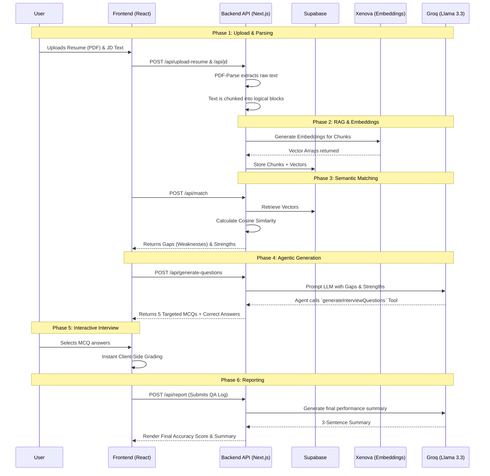

  

# 🚀 Career Copilot
> **Your Agentic AI Recruiter for Precision Interview Prep.**

**🔗 Live Deployment:** [https://hirepilot-ai-latest.vercel.app/](https://hirepilot-ai-latest.vercel.app)
**📊 Pitch Deck / Presentation:** [View Google Slides](https://docs.google.com/presentation/d/1mkSQ7MEmzu_f6xMZrEpaIH29l_BGVHjyL4G-PN2LFKs/edit?usp=sharing)

---

Welcome to **Career Copilot**, an advanced, open-source AI career assistant designed to help candidates prepare for technical interviews. By leveraging the power of Retrieval-Augmented Generation (RAG) and Agentic Tool-calling, Career Copilot analyzes your resume against a specific job description, identifies semantic gaps, and orchestrates a highly targeted mock interview to ensure you are ready for the real thing.

## 🎯 What is it about?

Applying for jobs often feels like throwing resumes into a black box. Even when candidates secure an interview, they are often caught off-guard by questions targeting their weakest areas. 

Career Copilot acts as your personal AI recruiter. Instead of generic interview prep, it performs a **semantic gap analysis** between your uploaded resume and the specific Job Description (JD) you are applying for. It then dynamically generates a tailored, Multiple Choice Question (MCQ) mock interview designed specifically to probe your weak points, testing your aptitude and technical stack knowledge.

## 💡 The Problem it Solves

1. **Blind Spots:** Candidates often don't realize where their resume falls short compared to a JD.
2. **Generic Preparation:** Standard interview prep platforms offer generic questions (e.g., "What are your weaknesses?") rather than testing the specific technical requirements of a role that the candidate lacks.
3. **Feedback Loop:** Getting instant, highly personalized feedback on technical knowledge is difficult without an expert technical interviewer present.

---

## 🛠 Tech Stack

We chose a modern, high-performance stack tailored for speed, scalability, and seamless AI integration.

### Core Framework
- **[Next.js 16 (App Router)](https://nextjs.org/) & React 19:** We utilize the Next.js App Router for a seamless blend of Server-Side Rendering (SSR) and interactive client components. API routes handle file parsing, embedding generation, and secure LLM communication.
- **[TypeScript](https://www.typescriptlang.org/):** Ensures end-to-end type safety, especially critical when handling complex JSON schemas returned by the AI agent.

### AI & Embeddings
- **[Groq (Llama 3.3 70B)](https://groq.com/):** The brain of the operation. We use Groq's blazing-fast inference engine for agentic tool-calling. It analyzes the RAG data and dynamically generates the targeted MCQ questions and post-interview summaries in milliseconds.
- **[@xenova/transformers](https://huggingface.co/docs/transformers.js):** Runs locally/server-side to generate high-dimensional vector embeddings from text chunks. This allows us to perform semantic mathematical comparisons without relying on expensive, high-latency third-party embedding APIs.

### Database & Storage
- **[Supabase](https://supabase.com/):** An open-source Firebase alternative powered by PostgreSQL. We use it to securely persist parsed resume chunks, JD chunks, and their associated vector embeddings.

### UI / UX
- **[Tailwind CSS v4](https://tailwindcss.com/):** Used to craft a stunning, dark-themed, and responsive interface using utility classes.
- **[Shadcn UI](https://ui.shadcn.com/) & [Lucide React](https://lucide.dev/):** Provides accessible, highly polished unstyled components (Cards, Buttons, Badges) and beautiful iconography to elevate the premium feel of the application.
- **pdf-parse:** A robust library used to extract raw text data from uploaded PDF resumes.

---

## 🏗 System Architecture

Career Copilot operates on a 4-step pipeline: **Upload**, **Analysis**, **Interview**, and **Report**.

### Architectural Highlights
1. **Client-Side Grading:** By forcing the LLM to pre-compute the correct answers and explanations during the generation phase, the actual interview grading happens instantaneously on the client's browser. This eliminates the need for expensive and slow backend LLM calls after every question.
2. **Custom Vector Math:** Instead of relying on database extensions like `pgvector`, Career Copilot computes Cosine Similarity directly in JavaScript `(lib/embeddings.ts)`. This makes the application incredibly resilient to database schema changes and heavily reduces database load.

---

## 🚀 How to Use for Preparation

1. **Navigate to the Upload Page:** Click the "New Analysis" button or start from the landing page.
2. **Provide your Data:**
   - Drag and drop your current Resume in PDF format.
   - Paste the exact Job Description (JD) of the role you are applying for.
3. **Review the Match Analysis:** The system will immediately show you a percentage match score, highlighting your exact strengths and missing skills based on semantic similarity.
4. **Start the Mock Interview:** Click to begin. You will be presented with 5 highly challenging, Multiple Choice Questions. *Note: Multiple options can be correct!*
5. **Instant Feedback:** Upon submitting an answer, you will immediately see if you were correct, what the correct answers were, and a detailed explanation of why.
6. **Review your Report:** Once finished, review your final Accuracy Score and the AI Recruiter's summary of your performance to understand exactly what to study next.

*Good luck with your interviews!*
